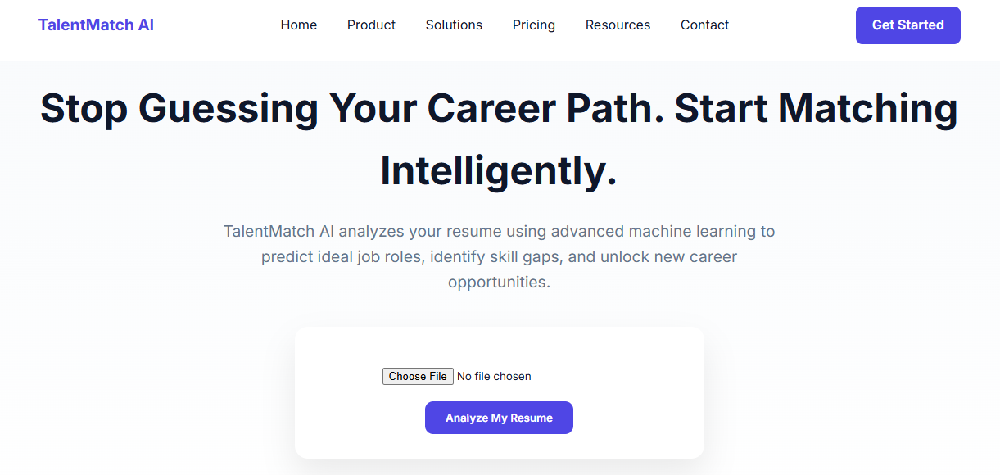
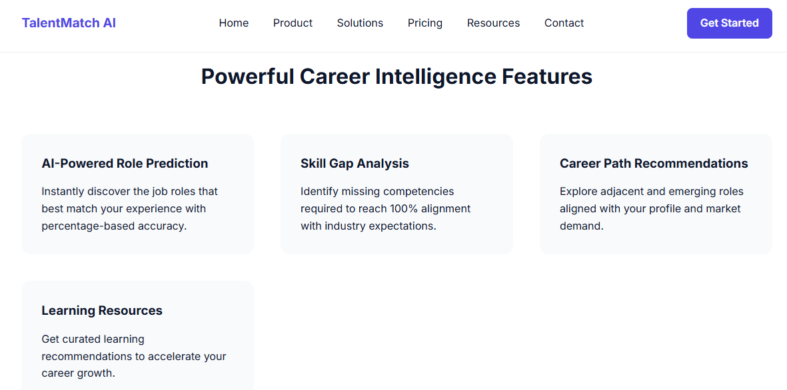
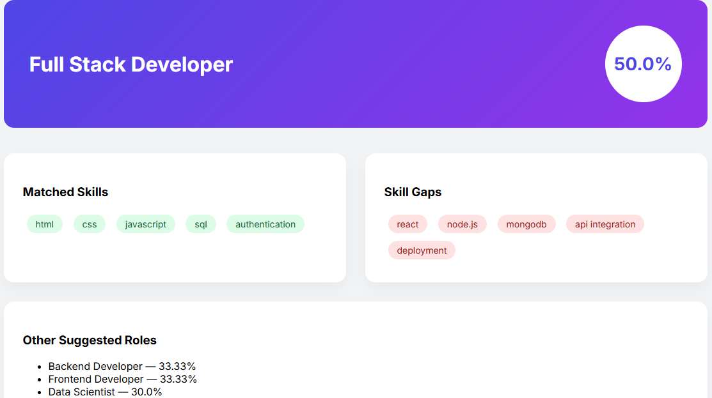
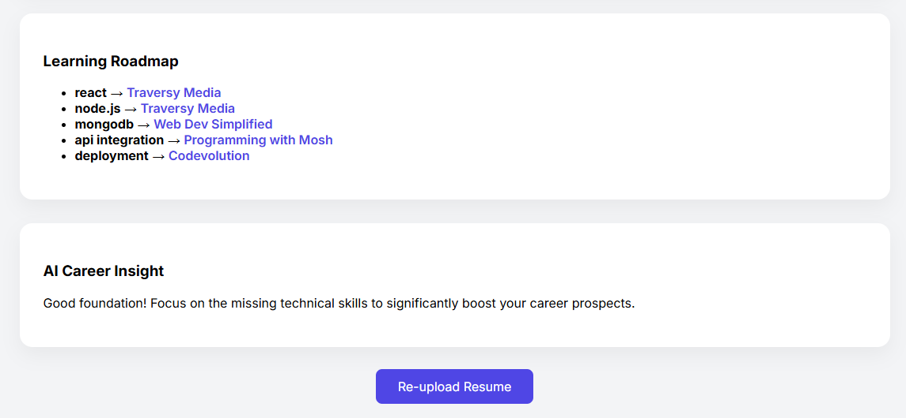

# 🚀 AI Resume Role Recommender

An AI-powered Resume Analysis & Skill Recommendation platform that predicts the most suitable tech career roles based on resume skills and provides a personalized learning roadmap.

---

## 🌟 Overview

AI Resume Role Recommender is a smart web application that analyzes resumes and predicts the best-matched tech career role using skill-based matching logic.

It also provides:
- 📊 Readiness percentage
- 🧠 Skill gap analysis
- 🎯 Related career roles
- 📚 Personalized YouTube learning suggestions
- 💬 Motivation message based on profile strength

---

## 🔥 Key Features

✔️ AI-Based Resume Analysis  
✔️ 10+ Serious Industry-Level Tech Roles  
✔️ 8–12 Important Skills Per Role  
✔️ Skill Gap Detection  
✔️ Readiness Percentage Calculation  
✔️ Related Role Suggestions  
✔️ Personalized Learning Recommendations  
✔️ Clean AI Dashboard Result Page  
✔️ Re-upload Resume Option  

---

## 💼 Supported Tech Roles

The system evaluates resumes against the following roles:

- Full Stack Developer
- Backend Developer
- Frontend Developer
- Data Scientist
- Machine Learning Engineer
- DevOps Engineer
- Cloud Engineer
- Cybersecurity Analyst
- Data Analyst
- Software Engineer

Each role contains 8–12 important industry skills defined directly inside the program.

---

## 🧠 How the Role Prediction Works

1. Resume text is extracted from PDF.
2. Text is converted to lowercase for consistent matching.
3. The system compares resume skills against predefined skills for each role.
4. For each role:

Match Percentage =  
(Number of Matched Skills ÷ Total Required Skills) × 100

5. The role with the highest percentage is selected as:
   → 🎯 Predicted Role

6. Missing skills are displayed as:
   → 📉 Skill Gaps

7. Related roles are shown based on next highest match scores.

---

## 📊 Example Output

Predicted Role: Full Stack Developer  
Readiness: 50%

Matched Skills:
- HTML
- CSS
- JavaScript
- SQL
- Authentication

Missing Skills:
- React
- Node.js
- MongoDB
- API Integration
- Deployment

---

## 🖼️ Screenshots

### 🏠 Home Page

---

### 📊 Result Dashboard

---

## 🛠️ Tech Stack

- Python
- Flask
- HTML
- CSS
- JavaScript
- Jinja2
- PDF Text Extraction Libraries

---

## 📁 Project Structure

career_role_recommender/

│  
├── app.py  
├── resume_logic.py  
├── templates/  
│   ├── index.html  
│   └── result.html  
├── static/  
|── uploads/  
---

## 🚀 Installation Guide

### 1️⃣ Clone Repository

git clone https://github.com/PriyankaMurthy39/AI-Resume-Role-Recommender.git

---

### 2️⃣ Navigate to Project Folder

cd career_role_recommender

---

### 3️⃣ Install Dependencies

pip install -r requirements.txt

---

### 4️⃣ Run Application

python app.py

---

### 5️⃣ Open in Browser

http://127.0.0.1:5000

---

## 🎯 Future Improvements

- NLP-based intelligent skill extraction
- ML-based role classification
- Resume comparison scoring
- PDF downloadable report
- User authentication system
- Deployment to cloud (Render / Railway / AWS)

---

## 👩‍💻 Author

Priyanka M
AI & Data Science Engineering Student  

---

## ⭐ Support

If you like this project, give it a ⭐ on GitHub!
